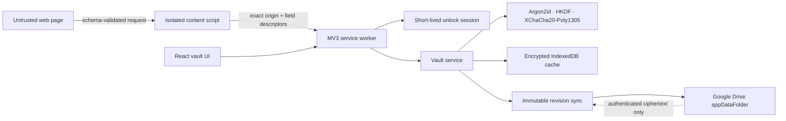

# VeyraKey

<div align="center">
  

  <h3>Your passwords. Your cloud. Your keys.</h3>

  <p>
    A browser-first, zero-knowledge password manager that encrypts vault data locally and can sync
    authenticated ciphertext through the user's own Google Drive.
  </p>

  [](release/release-manifest.json)
  [](package.json)
  [](#verification)
  [](apps/extension)
  [](apps/extension)

  [Quick start](#quick-start) · [Capabilities](#capabilities) · [Architecture](#architecture) · [Security](#security-model) · [Documentation](docs/README.md)
</div>

> [!WARNING]
> VeyraKey is a portfolio-grade release candidate, not an independently audited password manager.
> Do not use pre-release builds for irreplaceable secrets. Public release still requires the external
> evidence listed in [`release/external-gates.json`](release/external-gates.json).

## Why VeyraKey

Most password-manager demos stop at encrypted CRUD. VeyraKey treats the browser, cloud provider,
autofill surface, device unlock flow, revision history, and release pipeline as separate trust
boundaries.

| Principle | What it means in practice |
|---|---|
| **Zero knowledge** | Master passwords, Recovery Kits, plaintext records, vault keys, and device PRF outputs stay in the client. |
| **Bring your own storage** | Google Drive stores encrypted vault state in its private app-data area; it cannot decrypt the payload. |
| **Local-first** | A vault can be used without a cloud account. Cloud connection is optional and reversible. |
| **Origin-bound autofill** | Credentials are released only to an exact saved origin after the required local authorization. |
| **Recoverable by design** | Encrypted backups and Recovery Kits exist; a server-side reset or escrow key does not. |

## Product preview

<div align="center">
  
</div>

## Capabilities

### Passwords and autofill

- Encrypted logins, secure notes, identity profiles, and payment cards.
- Exact-origin username/password suggestions with guarded fill and submit behavior.
- Automatic save and update prompts that suppress unchanged duplicate credentials.
- Readable strong-password generation on recognized registration and password-change forms only.
- Identity and address autofill; payment-card support intentionally excludes stored CVV and purchase submission.
- Local TOTP generation and QR import for authenticator codes.

### Private email

- Automatic signup-only email aliases on recognized HTTPS registration forms.
- Provider-free plus addressing, generated per site with a random suffix.
- Optional SimpleLogin or Addy.io integration using the user's own encrypted provider token.
- Aliases are persisted only when the matching credential save is accepted, then follow normal encrypted sync.

### Storage and recovery

- Device-only local encrypted vault with no account requirement.
- Google-connected encrypted vault using Drive's private `appDataFolder` scope.
- Restore on another device with the same Google account and the existing vault master password.
- Account switching, cloud disconnect, encrypted backup, import preview, and atomic restore boundaries.
- Immutable item revisions, history inspection, and restore-as-new-revision semantics.

### Security tools

- Weak, reused, and aged-password analysis performed locally.
- Optional Pwned Passwords range checks that send a five-character SHA-1 prefix, never the password.
- WebAuthn PRF device unlock where the browser/authenticator combination supports it.
- Per-device enrollment status and revocation.
- Encrypted single-item sharing with a separate secret and bounded expiry.

### Passkey boundary

VeyraKey does **not** claim to replace the browser or operating system as a native passkey provider.
WebAuthn ceremonies and passkey private keys remain with the platform authenticator. The vault can
store bounded public passkey references and related account metadata, while TOTP secrets are
encrypted and generated locally. See
[`docs/39-private-email-and-passkey-boundary.md`](docs/39-private-email-and-passkey-boundary.md).

## Choose how to use it

| | Local vault | Google-connected vault |
|---|---|---|
| Account required | No | Google authorization |
| Source of truth | This browser profile | Encrypted Drive app data + local cache |
| Cross-device restore | Encrypted backup + Recovery Kit | Same Google account + vault unlock material |
| Cloud plaintext access | Not applicable | None by design |
| Can disconnect later | Not applicable | Yes; the local encrypted vault remains |

## Architecture



<div align="center">
  
</div>

### Monorepo map

```text
apps/
  extension/          WXT Manifest V3 extension for Chromium and Firefox
  web/                React/Vite development and recovery surface
  api/                Minimal Hono health worker; no vault keys or records
packages/
  crypto/             Project-owned cryptographic interface
  vault/              Key hierarchy, records, revisions, archives, sharing
  security/           Autofill policy, generation, TOTP, password health
  persistence/        IndexedDB repositories and compare-and-replace writes
  sync/               Revision graph, clocks, merge, provider orchestration
  provider-drive/     Google Drive provider adapter
  provider-onedrive/  Experimental OneDrive adapter (not a v0.10 release path)
  import-export/      CSV and Bitwarden-compatible import pipeline
  ui/                 Shared accessible React application shell
tooling/              Packaging, permission, CSP, secret, SBOM, and size gates
release/              Checksummed manifest, SBOM, and external release gates
```

## Security model

<div align="center">
  
</div>

VeyraKey generates random root and compartment keys, then wraps them for each authorized unlock
method. Password rotation rewraps keys instead of decrypting and rewriting every record.

| Layer | Construction | Purpose |
|---|---|---|
| Master-password slot | Argon2id | Memory-hard derivation of a key-encryption key |
| Payload encryption | XChaCha20-Poly1305 | Confidentiality and authentication for records and archives |
| Domain separation | HKDF-SHA-256 | Separate keys by purpose and slot |
| Recovery Kit | 32 random bytes, Bech32m encoded | Offline recovery without server escrow |
| Device unlock | WebAuthn PRF when available | Locally authorized key unwrap |

Critical invariants are executable where possible and documented in
[`docs/26-security-invariants.md`](docs/26-security-invariants.md). The threat model and explicit
non-goals are in [`docs/03-trust-and-threat-model.md`](docs/03-trust-and-threat-model.md) and
[`docs/17-constraints-and-non-goals.md`](docs/17-constraints-and-non-goals.md).

## Quick start

### Requirements

- Node.js `24.11.0`
- pnpm `11.10.0`

```bash
CI=true pnpm install --frozen-lockfile
pnpm dev:web
```

The development UI opens at `http://127.0.0.1:5173`.

### Build the extension

```bash
CI=true pnpm --dir apps/extension build
```

Load `apps/extension/.output/chrome-mv3` from `chrome://extensions` with Developer mode enabled.
After rebuilding or reloading the extension, refresh existing test pages so they receive the new
content script.

### Google Drive development setup

The application owner must register the extension OAuth client and enable the Drive API. End users
then connect with a normal Google consent flow; they never enter a client ID.

1. Create a Google Cloud OAuth client for the extension.
2. Register the built extension ID and required redirect URI.
3. Configure `VITE_GOOGLE_CLIENT_ID` for the build.
4. Grant only the Drive app-data scope used by the application.

OAuth consent, real-account restore, and account-switch tests remain external release gates because
they require provider configuration and user interaction.

## Development

| Command | Purpose |
|---|---|
| `pnpm lint` | Biome formatting and lint rules |
| `pnpm typecheck` | Strict TypeScript across the workspace |
| `pnpm test` | Unit, property, integration, lifecycle, and compatibility tests |
| `pnpm build` | Production builds for packages and applications |
| `pnpm check` | Full automated release gate, including packaged extension verification |
| `pnpm release:verify` | Checks, checksummed manifest, and release-status evaluation |

## Verification

The current release candidate passes:

- **259 tests across 38 test files**.
- Strict TypeScript checks across **13 workspace packages**.
- Web, Chrome MV3, and Firefox MV3 production builds.
- Extension packaging for Chrome, Firefox, and reviewable sources.
- Permission, CSP, source-map, embedded-secret, chunk-size, version-alignment, and SBOM checks.

The reproducible command is:

```bash
CI=true pnpm check
```

Automated success is not the same as public-release approval. Physical biometric devices, live
Google OAuth, browser-store signing, and independent security/accessibility review are tracked in
[`docs/40-external-release-evidence.md`](docs/40-external-release-evidence.md).

## Documentation

Start with [`docs/README.md`](docs/README.md). Useful entry points:

- [Product requirements](docs/01-product-requirements.md)
- [System architecture](docs/02-system-architecture.md)
- [Cryptography and key management](docs/04-cryptography-and-key-management.md)
- [BYOS sync protocol](docs/06-byos-sync-protocol.md)
- [Browser extension architecture](docs/08-browser-extension-architecture.md)
- [Testing and quality strategy](docs/14-testing-and-quality-strategy.md)
- [Security invariants](docs/26-security-invariants.md)
- [UX and accessibility](docs/28-ux-and-accessibility.md)
- [Release runbook](docs/33-v1-release-runbook.md)
- [Implementation status](docs/36-enterprise-password-manager-status.md)

## Responsible use and disclosure

Read [`SECURITY.md`](SECURITY.md) before reporting a vulnerability. Never include real passwords,
Recovery Kits, OAuth tokens, or vault exports in an issue.

---

<div align="center">
  <strong>VeyraKey</strong><br />
  Built as an engineering portfolio project around explicit trust boundaries, reproducible evidence,
  and honest capability claims.
</div>
