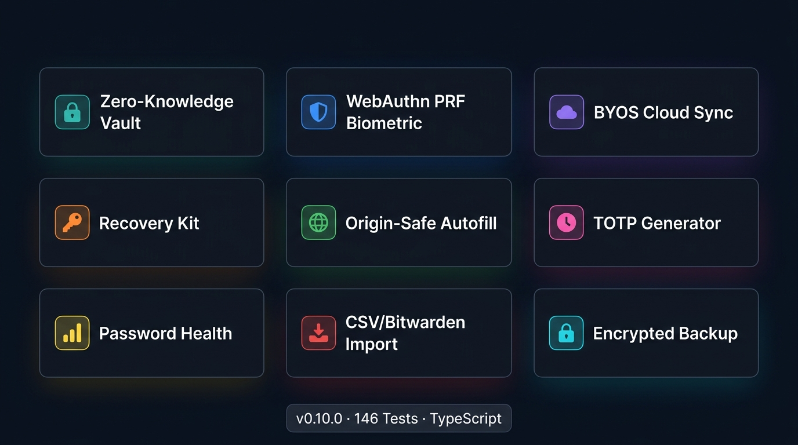
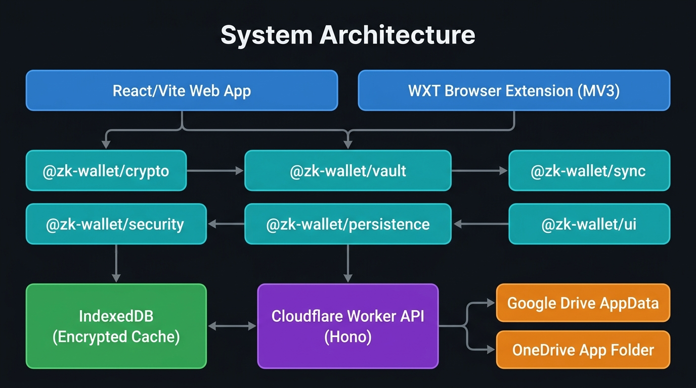
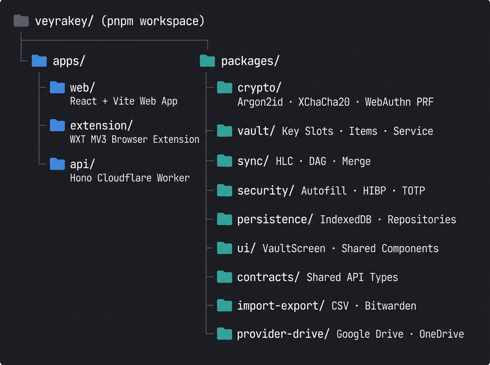
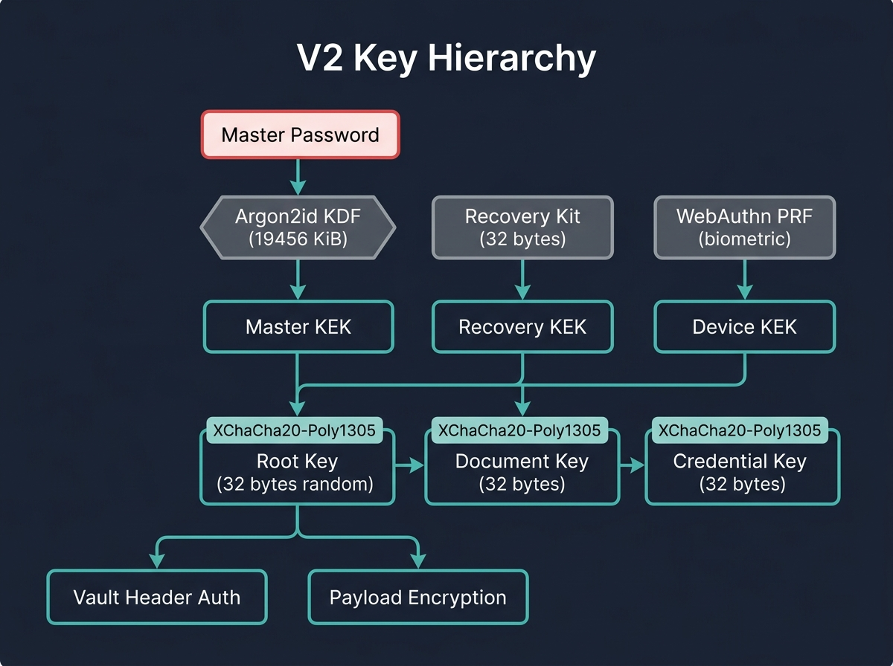

<](CHANGELOG.md)
[](https://www.typescriptlang.org/)
[](https://nodejs.org/)
[](https://pnpm.io/)
[](vitest.config.ts)
[](LICENSE)
[](apps/extension)

<br/>

> **A browser-first, zero-knowledge password manager built as an industry-grade portfolio project.**
> Vault keys, master passwords, Recovery Kits, and OAuth tokens never leave your client.
> Google Drive and OneDrive receive only authenticated ciphertext — your cloud stores secrets it cannot read.

<br/>

[🚀 Quick Start](#-quick-start) • [🏗 Architecture](#-system-architecture) • [🔐 Security Model](#-security-model) • [📦 Packages](#-monorepo-packages) • [🛠 Development](#-development) • [📚 Docs](#-documentation)

</div>

---

## ✨ Features at a Glance

<div align="center">

</div>

<br/>

| Category | Capability |
|---|---|
| 🔐 **Vault** | Logins · Secure Notes · Identity Profiles · Payment Cards |
| 🔑 **Unlock** | Master Password · Recovery Kit · WebAuthn PRF (Touch ID / Face ID) |
| ☁️ **Sync** | Google Drive `appDataFolder` · Microsoft OneDrive · Offline-first IndexedDB cache |
| 🌐 **Autofill** | Exact-origin matching · MV3 content script · Save/update prompts · TOTP fill |
| 🔒 **Crypto** | Argon2id · XChaCha20-Poly1305-IETF · HKDF-SHA-256 · Bech32m Recovery Kit |
| 📊 **Security** | Weak/reused/old password analysis · k-anonymous HIBP breach checks |
| 📥 **Import** | Generic CSV · Bitwarden-compatible · Dry-run preview · Atomic rollback |
| 💾 **Backup** | Encrypted portable archive with full revision history · Clean-profile restore |
| 🏷️ **Organize** | Tags · Favorites · Folders · Encrypted local full-text search |
| 🧪 **Quality** | 146 tests across 29 test files · Property-based · Integration · Chaos corpus |

---

## 🏗 System Architecture

<div align="center">

</div>

<br/>

VeyraKey is a **pnpm monorepo** with strict package-boundary enforcement. Three application targets share a common set of cryptographic and vault packages:

```
User
 ├─▶ apps/web          React + Vite web application (full vault UI)
 └─▶ apps/extension    WXT Manifest V3 extension (Chromium + Firefox)
        │
        ├─▶ packages/crypto       Argon2id · XChaCha20 · WebAuthn PRF
        ├─▶ packages/vault        Key hierarchy · Item CRUD · Service layer
        ├─▶ packages/sync         HLC · Revision DAG · Deterministic merge
        ├─▶ packages/security     Autofill decisions · HIBP · TOTP · Generation
        ├─▶ packages/persistence  IndexedDB repositories (encrypted)
        ├─▶ packages/ui           Shared React vault screen and components
        ├─▶ packages/import-export CSV + Bitwarden import/export
        └─▶ packages/provider-drive Google Drive + OneDrive adapters

        ──▶ apps/api              Hono on Cloudflare Workers (health endpoint only)
```

### Component Responsibilities

| Component | Role |
|---|---|
| **Web App** | Full vault UI, OAuth BYOS setup, Google/OneDrive sync management |
| **Browser Extension** | Secure unlock sessions, autofill, save/update prompts, TOTP fill |
| **`@zk-wallet/crypto`** | All cryptographic primitives behind a project-owned interface |
| **`@zk-wallet/vault`** | Key slots, wrapped-key sets, item revisions, vault service |
| **`@zk-wallet/sync`** | Immutable revision DAG, HLC clocks, provider adapters, conflict resolution |
| **`@zk-wallet/security`** | Origin-safe autofill, credential capture, HIBP checks, TOTP, password generation |
| **`@zk-wallet/persistence`** | `IndexedDbVaultHeaderRepository`, `IndexedDbItemRevisionRepository` |
| **`@zk-wallet/ui`** | `VaultScreen.tsx` (133 KB) – all vault UI states in a single accessible component |
| **API Worker** | Minimal Hono Cloudflare Worker; exposes `/v1/health` only; no vault secrets |

---

## 📁 Monorepo Structure

<div align="center">

</div>

<br/>

```
veyrakey/
├── apps/
│   ├── api/                  Hono Cloudflare Worker (src/index.ts, 39 lines)
│   │   └── src/index.ts      Security headers · /v1/health · 404 handler
│   ├── extension/            WXT MV3 browser extension
│   │   ├── entrypoints/
│   │   │   ├── background.ts Service worker (747 lines) – vault, session, autofill
│   │   │   ├── autofill.content.ts Content script (31 KB) – form detection + fill
│   │   │   └── popup/        Extension popup UI
│   │   └── src/              Extension-specific auth, session, PRF, autofill index
│   └── web/
│       └── src/              React app shell, Google Drive, OneDrive OAuth wiring
├── packages/
│   ├── contracts/            Shared health constants (HEALTH_PATH, HEALTH_RESPONSE)
│   ├── crypto/               Crypto primitives (577 lines)
│   │   └── src/index.ts      CryptoProvider · DevicePrfProvider · WebAuthn PRF
│   ├── import-export/        CSV + Bitwarden importers (8 KB)
│   ├── persistence/          IndexedDB repositories (22 KB)
│   ├── provider-drive/       Google Drive + OneDrive sync adapters (16 KB)
│   ├── provider-onedrive/    OneDrive-specific PKCE OAuth adapter
│   ├── security/             Autofill engine + secrets (20 KB total)
│   │   ├── src/index.ts      decideAutofill · findCredentialFields · fillCredentialFields
│   │   ├── src/secrets.ts    generatePassword · generatePassphrase · generateTotp
│   │   └── src/password-health.ts analyzePasswordHealth · checkPwnedPassword
│   ├── sync/                 Sync engine (13 KB)
│   │   └── src/index.ts      SyncEngine · HybridLogicalClock · RevisionDAG
│   ├── ui/                   Shared React UI (133 KB VaultScreen)
│   └── vault/                Core vault logic (16 files, ~180 KB)
│       ├── src/types.ts      VaultClient · VaultError · all public types
│       ├── src/items.ts      LoginItem · SecureNote · IdentityProfile · PaymentCard
│       ├── src/service.ts    createVaultService (2523 lines) – the vault brain
│       ├── src/header.ts     VaultHeaderV1/V2 parsing and validation
│       ├── src/archive.ts    Encrypted archive create/restore
│       ├── src/recovery.ts   Bech32m Recovery Kit encode/decode
│       └── src/search.ts     Encrypted local search index
├── tooling/                  Artifact verification, release manifest, smoke tests
├── docs/                     40+ architecture, security, and progress documents
├── biome.json                Biome linter + formatter config
├── vitest.config.ts          Test runner config with jsdom + fake-indexeddb
└── pnpm-workspace.yaml       Monorepo catalog, allowBuilds, overrides
```

---

## 🔐 Security Model

<div align="center">

</div>

### Zero-Knowledge Guarantees

VeyraKey's server **never possesses** keys that decrypt vault content. The following secrets never leave the client:

- Master passwords and KDF outputs
- Recovery Kit secrets (32 random bytes, Bech32m encoded)
- WebAuthn PRF results (biometric unlock material)
- Root, document, and credential keys
- Plaintext vault records and item contents
- Google/Microsoft OAuth access tokens

### V2 Key Hierarchy

```
Master Password ──▶ Argon2id (≥19,456 KiB · t=2 · p=1) ──▶ Master KEK
Recovery Kit    ──▶ HKDF-SHA-256                          ──▶ Recovery KEK
WebAuthn PRF    ──▶ HKDF-SHA-256                          ──▶ Device KEK
                                                                   │
                              ┌────────────────────────────────────┤
                              ▼                    ▼               ▼
                         Root Key (32B)    Document Key (32B)  Credential Key (32B)
                         (random, never   (compartment,       (compartment,
                          derived from    step-up required)    step-up required)
                          password)
                              │
                    ┌─────────┴──────────┐
                    ▼                    ▼
             Vault Header Auth    Payload Encryption
             (HKDF + seal tag)   (XChaCha20-Poly1305)
```

Every key wrapper uses **XChaCha20-Poly1305-IETF** with a 24-byte random nonce. Authenticated Additional Data (AAD) binds: algorithm, vault ID, slot ID, envelope version, schema version, and purpose label.

### Cryptographic Primitives

| Primitive | Library / Standard | Use |
|---|---|---|
| **Password KDF** | `libsodium-wrappers-sumo@0.8.4` Argon2id 1.3 | Master password hardening |
| **AEAD** | libsodium XChaCha20-Poly1305-IETF | All envelope encryption |
| **Key Derivation** | WebCrypto HKDF-SHA-256 | Domain separation, slot KEKs |
| **Recovery Encoding** | `@scure/base@2.2.0` Bech32m (`zkwr` prefix) | Recovery Kit encoding |
| **Randomness** | `crypto.getRandomValues` (platform only) | Nonces, salts, IDs, challenges |
| **Biometric Unlock** | WebAuthn Level 3 `prf` extension | Touch ID / Face ID key wrap |

### Security Tag (V2 Header Authentication)

Every V2 vault header includes a `securityTag`: a 40-byte base64url value derived by sealing empty plaintext with XChaCha20-Poly1305 using the canonical JSON of all mutable header fields as AAD, authenticated against a root-derived HKDF key. This binds device slots, key wrappers, payload ciphertext, and revision as one root-authenticated unit — **without rewriting payload ciphertext during password rotation**.

### Trust Boundaries

| Boundary | Guarantee |
|---|---|
| Application server | Cannot decrypt vault content (no keys ever sent) |
| Cloud provider (Drive/OneDrive) | Sees only authenticated ciphertext in app-private folders |
| Content scripts | Receive only minimum fields for active origin + operation |
| BYOS provider | Cannot derive keys even with full ciphertext access |

### Non-Goals (Intentional Limits)

- ❌ Server-side password reset / key escrow
- ❌ Emergency access backdoor
- ❌ Cloud AI receiving vault data
- ❌ JavaScript memory zeroization guarantees (best-effort only)
- ❌ Freshness proof against a provider presenting old self-consistent history

---

## 🔄 Sync Protocol (BYOS)

VeyraKey uses a **Bring Your Own Storage** model. Your cloud provider stores immutable encrypted objects only.

```
Client Write Path:
  1. Validate domain model
  2. Advance Hybrid Logical Clock (HLC)
  3. Reference current parent revision heads
  4. Encrypt/authenticate new immutable revision (XChaCha20-Poly1305)
  5. Commit to IndexedDB (encrypted) + queue upload
  6. Upload idempotently to BYOS provider
  7. Publish encrypted snapshot candidate

Pull + Merge Path:
  1. Read provider change feed from last safe cursor
  2. Download unseen opaque revisions
  3. Authenticate envelope + validate schema
  4. Build revision DAG, detect conflicts
  5. Apply deterministic merge rules
  6. Create conflict copies for competing secret edits
  7. Update local snapshot after durable commit
```

**Merge Policy:**
- Identical revisions are idempotent
- Causally-later revisions replace ancestors (DAG ordering)
- Independent metadata edits merge deterministically
- Competing secret values / delete+edit races create visible conflict copies
- Clients always converge from the same valid revision set regardless of delivery order

---

## 🌐 Browser Extension Architecture

The MV3 extension follows a strict layered model to prevent credential leakage:

```
┌─────────────────────────────────────────────────────┐
│  Hostile Page (MAIN world)                          │
│        │ minimal WebAuthn bridge only               │
├────────▼─────────────────────────────────────────── │
│  Isolated Content Script                            │
│  • Form detection (findCredentialFields)            │
│  • Origin-safe fill (fillCredentialFields)          │
│  • Schema-validated messages only                   │
│        │ chrome.runtime.sendMessage                 │
├────────▼─────────────────────────────────────────── │
│  MV3 Service Worker (background.ts)                 │
│  • VaultService + ExtensionSessionCoordinator       │
│  • Autofill decisions (decideAutofill)              │
│  • Credential capture (decideCredentialCapture)     │
│  • HIBP checks · TOTP generation                    │
│        │ browser.storage.session                    │
├────────▼─────────────────────────────────────────── │
│  Extension Popup / Side Panel                       │
│  • VaultScreen (search, add, autofill choices)      │
│  • Biometric step-up UI                             │
└─────────────────────────────────────────────────────┘
```

**Autofill Security Rules:**
- Only fires on `https:` or localhost (never `http:` on live sites)
- Blocks cross-origin iframe fills unconditionally
- Requires explicit user action before releasing any credential
- Exact origin match by default; related-domain requires explicit saved policy
- Save/update prompts show destination origin before writing anything

---

## 🚀 Quick Start

### Prerequisites

| Tool | Version |
|---|---|
| Node.js | `24.11.0` (exact) |
| pnpm | `11.10.0` (exact) |

### Run the Web App

```sh
# Install all dependencies (frozen lockfile — reproducible)
CI=true pnpm install --frozen-lockfile

# Start the web app dev server
pnpm dev:web
```

Open [`http://127.0.0.1:5173`](http://127.0.0.1:5173) in Chrome or Firefox.

> ⚠️ The app requires WebCrypto API and IndexedDB. Embedded iframes/previews (Codex, Figma embeds, etc.) cannot operate the vault.

### First Use

1. **Create a vault** — choose Personal Cloud (recommended) or Device-Only storage. Set a strong master password.
2. **Save your Recovery Kit** — re-enter it immediately to verify the drill. Losing all unlock methods is **permanently unrecoverable** — no server reset exists.
3. **Add items** — Logins, Secure Notes, Identity Profiles, Payment Cards.
4. **Download an encrypted backup** before clearing browser data.

### Restore on a New Device

1. Open the app → **Restore**
2. Connect the same cloud account
3. Enter your Recovery Kit
4. Set a new local master password

---

## 📦 Monorepo Packages

### `@zk-wallet/crypto`
> **577 lines** · `packages/crypto/src/index.ts`

The cryptographic foundation. All primitives are isolated behind this interface — application code never calls libsodium or WebCrypto directly.

| Export | Description |
|---|---|
| `createCryptoProvider()` | Returns `CryptoProvider` with `deriveArgon2id`, `hkdfSha256`, `sealXChaCha20Poly1305`, `openXChaCha20Poly1305`, `randomBytes` |
| `createWebAuthnPrfProvider()` | WebAuthn PRF enrollment and evaluation for biometric unlock |
| `encodeEnvelopeAad()` | Length-prefixed AAD serialization (prevents field reordering attacks) |
| `assertProductionKdfParameters()` | Enforces Argon2id ≥19,456 KiB/t=2/p=1 floor |
| `zeroBytes()` | Best-effort memory zeroization |
| Encoding helpers | `bytesToBase64Url` · `base64UrlToBytes` · `bytesToHex` · `hexToBytes` · `utf8ToBytes` |

**Key constants:**
```typescript
ARGON2ID_PRODUCTION_FLOOR = { memoryKiB: 19_456, operations: 2, outputLength: 32, parallelism: 1 }
XCHACHA20_POLY1305_KEY_BYTES   = 32
XCHACHA20_POLY1305_NONCE_BYTES = 24
XCHACHA20_POLY1305_TAG_BYTES   = 16
```

---

### `@zk-wallet/vault`
> **16 source files** · `packages/vault/src/`

The core vault domain. Manages key slots, item revisions, and the complete vault lifecycle.

#### Key Types (`types.ts` — 323 lines)

| Type | Description |
|---|---|
| `VaultHeaderV2` | Current header format with master slot, recovery slot, device slots, security tag, revision |
| `MasterPasswordSlotV2` | Argon2id KDF params + three-envelope wrapped key set |
| `RecoveryKitSlotV1` | Bech32m Recovery Kit with three-envelope wrapped key set |
| `ActiveDeviceSlotV2` | WebAuthn PRF credential + scope + three-envelope wrapped key set |
| `WrappedKeySetV1` | Root + document + credential key envelopes |
| `VaultClient` | Full vault interface (~30 methods) |
| `VaultError` | Typed error codes (`VAULT_LOCKED`, `VAULT_WRITE_CONFLICT`, etc.) |

#### Item Types (`items.ts` — 753 lines)

```typescript
interface LoginItemInput     { title, username, password, uris[], notes, totpUri?, breachCheck?, tags, folder, favorite }
interface SecureNoteItemInput { title, note, tags, folder, favorite }
interface IdentityProfileItemInput { firstName, lastName, email, phone, address fields... }
interface PaymentCardItemInput { cardholderName, cardNumber, expiryMonth, expiryYear, securityCode, billingAddress }
```

All fields have enforced byte limits (e.g., `MAX_PASSWORD_BYTES = 8192`, `MAX_NOTE_BYTES = 1_048_576`).

#### Vault Service (`service.ts` — 2,523 lines)

The central vault brain. Key behaviors:

| Method | What it does |
|---|---|
| `createVault(masterPassword)` | Generates Argon2id salt, derives KEK, creates random root/doc/cred keys, writes V2 header with security tag |
| `unlock(masterPassword)` | KDF-derives KEK, unwraps root key, verifies security tag, loads items |
| `unlockWithDevice(slotId)` | WebAuthn PRF ceremony → unwrap keys → verify tag |
| `unlockWithRecoveryKit(kit)` | Decode Bech32m → unwrap keys → verify tag |
| `changeMasterPassword(req)` | Rewraps same random root/doc/cred keys without touching payload ciphertext |
| `enrollDevice(masterPassword)` | PRF enrollment ceremony → add active slot → increment revision → refresh tag |
| `revokeDevice(slotId)` | Replace with tombstone → increment revision → refresh tag |
| `createLogin(input)` | Validates → encrypts revision → persists → queues sync upload |
| `searchItems(query)` | Queries encrypted local search index → decrypts matching items |
| `exportEncryptedArchive()` | Full history with wrapped keys for cross-device/provider restore |

---

### `@zk-wallet/security`
> `packages/security/src/` · 3 modules

#### Autofill Engine (`index.ts` — 300 lines)

```typescript
// Origin-safe autofill decision
decideAutofill({ credentials, frameUrl, topUrl, userInitiated }): AutofillDecision
// → allowed: true (exact origin match) | false (with reason: INSECURE_SCHEME, CROSS_ORIGIN_FRAME, etc.)

// Form field detection
findCredentialFields(root: ParentNode): CredentialFormFields | null
// → { password: HTMLInputElement, username: HTMLInputElement | null }

// Credential fill (dispatches React-compatible synthetic events)
fillCredentialFields(fields, { username, password }): void

// Save/update decision
decideCredentialCapture({ captured, credentials, frameUrl, topUrl }): CredentialCaptureDecision
// → { action: 'save' | 'update' | 'none', ... }
```

#### Secrets (`secrets.ts`)

```typescript
generatePassword(options)   // CSPRNG · configurable length/charset/exclusions/min-counts
generatePassphrase(options) // Wordlist-based · entropy-aware · no modulo bias
generateTotp(config)        // RFC 6238 TOTP · HMAC-SHA1/256/512 · countdown
parseOtpAuthUri(uri)        // otpauth:// URI parser
parseOtpAuthQr(image)       // QR code → OTP config (optional QrCodeDetector)
copyWithBestEffortClear()   // Clipboard copy with timeout clearing
```

#### Password Health (`password-health.ts`)

```typescript
analyzePasswordHealth(logins[]): PasswordHealthFinding[]
// → weak (zxcvbn-style score) · reused · old · unsecured-http-origin

checkPwnedPassword(password, options): Promise<PwnedPasswordResult>
// → k-anonymous HIBP range query (sends only first 5 SHA-1 hex chars)
```

---

### `@zk-wallet/sync`
> `packages/sync/src/index.ts` — 12 KB

```typescript
// Hybrid Logical Clock
class HybridLogicalClock { advance(wallMs): HLCTimestamp }

// Revision DAG
class RevisionDAG {
  insert(revision): void
  heads(): RevisionId[]
  ancestors(id): RevisionId[]
  lca(a, b): RevisionId | null
}

// Deterministic merge
mergeRevisions(local[], remote[]): MergeResult
// → { merged: RevisionId[], conflicts: ConflictSet }
```

---

### `@zk-wallet/persistence`
> `packages/persistence/src/index.ts` — 22 KB

```typescript
class IndexedDbVaultHeaderRepository  // create() · read() · replace(condition, header)
class IndexedDbItemRevisionRepository // put() · list() · listSince(cursor)
```

All writes use compare-and-replace conditioned on `{ vaultId, version, revision }`. A loser locks and reloads.

---

### `@zk-wallet/import-export`

```typescript
parseGenericCsv(input): ImportPreview       // Generic CSV with dry-run counts
parseBitwardenExport(input): ImportPreview  // Bitwarden JSON export format
```

Provides dry-run preview, field-loss warnings, formula/control-character-safe display, duplicate detection, and all-or-nothing rollback boundaries.

---

### `apps/api` — Hono Cloudflare Worker

```typescript
// apps/api/src/index.ts (39 lines)
const app = new Hono()

// Security headers on every response
app.use("*", addSecurityHeaders)
// → Cache-Control: no-store
// → Content-Security-Policy: default-src 'none'; ...
// → X-Frame-Options: DENY
// → X-Content-Type-Options: nosniff

// Only one route: health check
app.get("/v1/health", () => json(HEALTH_RESPONSE))
```

The Worker has **no access to vault keys, user secrets, or vault content**. It exists solely for infrastructure health checks and future capability signaling.

---

## 🌩 Cloud Sync Setup

### Google Drive (Recommended)

1. Create a Google Cloud project → enable **Google Drive API**
2. Configure OAuth consent screen → add your account as a test user
3. Create **Web application** OAuth client
4. Add `http://127.0.0.1:5173` as authorized JavaScript origin
5. Add `http://127.0.0.1:5173/oauth/google/callback` as redirect URI
6. Set env var:
   ```sh
   VITE_GOOGLE_CLIENT_ID=your-client-id.apps.googleusercontent.com
   ```
7. In the app: **Settings → Connect Google Drive**

The app requests only `drive.appdata` scope. Access tokens live **in memory only** and are discarded on disconnect/reload.

### Microsoft OneDrive

1. Register a **Single-Page Application** in Microsoft Entra
2. Add delegated permission: `Files.ReadWrite.AppFolder`
3. Add redirect URI: `http://127.0.0.1:5173/oauth/microsoft/callback`
4. Enable personal Microsoft accounts for consumer OneDrive
5. Set env var:
   ```sh
   VITE_MICROSOFT_CLIENT_ID=your-application-client-id
   ```
6. In the app: **Settings → Connect OneDrive**

Uses OAuth Authorization Code + PKCE. Access tokens retained **in memory only**.

> 💡 OAuth client IDs are public application configuration, not user secrets.

---

## 🔌 Browser Extension

### Load in Chrome

```sh
# Build the extension
CI=true pnpm --filter veyrakey-extension build

# Load it
# 1. Open chrome://extensions
# 2. Enable Developer mode
# 3. Click "Load unpacked"
# 4. Select: apps/extension/.output/chrome-mv3
```

### Load in Firefox

```sh
# 1. Open about:debugging
# 2. Click "This Firefox" → "Load Temporary Add-on"
# 3. Select: apps/extension/.output/firefox-mv2/manifest.json
```

> After every extension rebuild, reload already-open login pages so Chrome invalidates old content scripts.

---

## 🛠 Development

### Commands

```sh
# Development
pnpm dev:web          # Start web app at http://127.0.0.1:5173
pnpm dev:extension    # Start extension watch mode
pnpm dev:api          # Start Cloudflare Worker dev server

# Quality checks
pnpm lint             # Biome format + lint check
pnpm format           # Biome auto-format
pnpm typecheck        # tsc across all packages
pnpm test             # Vitest run (146 tests)
pnpm test:watch       # Vitest watch mode

# Build
pnpm build            # Build all packages + apps

# Release validation
pnpm release:package  # Package extension ZIPs
pnpm release:manifest # Write checksummed release manifest
pnpm release:status   # Verify public release gates
pnpm check            # Full pipeline: lint → typecheck → test → build → verify
```

### Environment Variables

| Variable | App | Description |
|---|---|---|
| `VITE_GOOGLE_CLIENT_ID` | web, extension | Google OAuth client ID for Drive BYOS |
| `VITE_MICROSOFT_CLIENT_ID` | web, extension | Microsoft Entra client ID for OneDrive |

Copy `.env.example` to `.env.local` in `apps/web/` or `apps/extension/`.

### Tech Stack

| Layer | Technology |
|---|---|
| **Frontend** | React 19 · Vite · TypeScript 7 |
| **Extension** | WXT · Manifest V3 · Chrome + Firefox |
| **API** | Hono · Cloudflare Workers |
| **Crypto** | libsodium-wrappers-sumo 0.8.4 · WebCrypto |
| **Storage** | IndexedDB (encrypted) |
| **Testing** | Vitest · @testing-library/react · fake-indexeddb · fast-check |
| **Tooling** | pnpm workspaces · Biome · TypeScript strict mode |
| **Package Manager** | pnpm 11.10.0 (exact pins, frozen lockfile) |

---

## 🧪 Testing

```sh
pnpm test
# ✓ 146 tests passing across 29 test files
```

### Test Categories

| Package | Tests | What's Covered |
|---|---|---|
| `@zk-wallet/crypto` | 41 | Argon2id vectors, HKDF RFC 5869, XChaCha20 rounds, PRF enrollment/evaluation, nonce uniqueness |
| `@zk-wallet/vault` | 78 | Full V1→V2 lifecycle, key rotation, compartment step-up, concurrency, recovery drill, conflict detection |
| `@zk-wallet/security` | 42 | Autofill decisions, form detection, HIBP prefix protocol, TOTP RFC vectors, password generation bias |
| `@zk-wallet/sync` | 15 | HLC ordering, DAG construction, conflict detection, merge determinism |
| `@zk-wallet/persistence` | 12 | IndexedDB CRUD, compare-and-replace, serialization safety |
| Extension | 8 | Manifests, autofill, session handling |
| Web App | 6 | Shell rendering, OAuth wiring |

### Property-Based and Chaos Tests

The test suite includes **fast-check** property tests and chaos corpus exercises:
- Arbitrary revision delivery ordering (sync convergence)
- Duplicate/retried writes (idempotency)
- Tampered/truncated/reordered ciphertext (authentication rejection)
- Wrong key / wrong vault / wrong schema (failure isolation)
- Parser limits and oversized inputs
- Interrupted compaction and partial state recovery

---

## 📋 Implementation Status

| # | Task | Status |
|---:|---|:---:|
| 1 | Secure walking skeleton | ✅ Complete |
| 2 | Vault crypto and unlock | ✅ Complete |
| 3 | Recovery, compartments, PRF unlock | ✅ Complete |
| 4 | Encrypted login/note CRUD | ✅ Complete |
| 5 | Immutable sync engine | ✅ Complete |
| 6 | Google Drive BYOS | ✅ Complete |
| 6A | Microsoft OneDrive BYOS | ✅ Locally complete |
| 7 | Secure MV3 extension sessions | ✅ Complete |
| 8 | Origin-safe autofill/capture | ✅ Complete |
| 9 | Password generation / TOTP / clipboard | ✅ Complete |
| 10 | Organization / encrypted search | ✅ Complete |
| 11 | Focused import / encrypted backup | ✅ Complete |
| 12 | Password-health dashboard / HIBP | ✅ Complete |
| 13 | Whole-system hardening / accessibility | ✅ Complete |
| 14 | Portfolio deployment / release | 🔄 Local RC complete |

**146 tests · 29 test files · pnpm check ✅**

---

## 📚 Documentation

The [`docs/`](docs/) directory contains 40+ architecture and security documents:

| Document | Description |
|---|---|
| [`00-project-overview.md`](docs/00-project-overview.md) | Mission and scope summary |
| [`02-system-architecture.md`](docs/02-system-architecture.md) | Component diagram, data flows |
| [`03-trust-and-threat-model.md`](docs/03-trust-and-threat-model.md) | Threat model and trust boundaries |
| [`04-cryptography-and-key-management.md`](docs/04-cryptography-and-key-management.md) | Full crypto specification |
| [`05-vault-data-model.md`](docs/05-vault-data-model.md) | Item schemas and revision format |
| [`06-byos-sync-protocol.md`](docs/06-byos-sync-protocol.md) | Sync protocol, merge policy |
| [`08-browser-extension-architecture.md`](docs/08-browser-extension-architecture.md) | Extension security model |
| [`09-password-security-features.md`](docs/09-password-security-features.md) | Autofill, TOTP, health dashboard |
| [`20-progress.md`](docs/20-progress.md) | Detailed task completion log |
| [`21-architecture-decisions.md`](docs/21-architecture-decisions.md) | 52 KB of ADRs |
| [`26-security-invariants.md`](docs/26-security-invariants.md) | Non-negotiable security rules |
| [`33-v1-release-runbook.md`](docs/33-v1-release-runbook.md) | Release verification steps |

---

## 🔒 Security Policy

See [`SECURITY.md`](SECURITY.md) for the vulnerability disclosure policy.

**Key invariants that cannot be weakened:**
1. Master passwords, Recovery Kit secrets, PRF outputs, and vault keys never enter application-server storage or logs
2. Google account sign-in identifies the account; master password unlocks the vault locally
3. No server reset, escrow, or emergency-access backdoor
4. Every persistent vault object is encrypted and authenticated before leaving the trusted client runtime
5. No cloud AI receives vault data

---

## 🗺 Roadmap

VeyraKey v1 is a **portfolio project** demonstrating industry-grade cryptographic engineering. Planned future work (not v1 commitments):

- 🔮 Software passkeys (credential compartment sync)
- 🔮 WebDAV BYOS provider
- 🔮 Document wallet (chunked encrypted documents)
- 🔮 Digital credential wallet (OpenID4VCI / OpenID4VP)
- 🔮 Safari extension support
- 🔮 Native desktop/mobile apps

See [`docs/32-future-work.md`](docs/32-future-work.md) and [`docs/38-portfolio-flagship-roadmap.md`](docs/38-portfolio-flagship-roadmap.md).

---

## ⚠️ Limitations

- This project has **not received an independent security audit**. Use synthetic data during review.
- JavaScript runtimes do not guarantee deterministic memory zeroization (best-effort).
- Traffic analysis can reveal account activity, timing, and ciphertext sizes to the cloud provider.
- Physical biometric (Touch ID / Face ID) and real-account OAuth remain manual platform evidence gates.
- Free-tier infrastructure is not an SLA.

---

## 📄 License

MIT — see [LICENSE](LICENSE).

---

<div align="center">

Built with ❤️ using TypeScript, React, WebCrypto, and libsodium.

**VeyraKey v0.10.0** · Your keys, your vault, your cloud.

</div>
]]>
