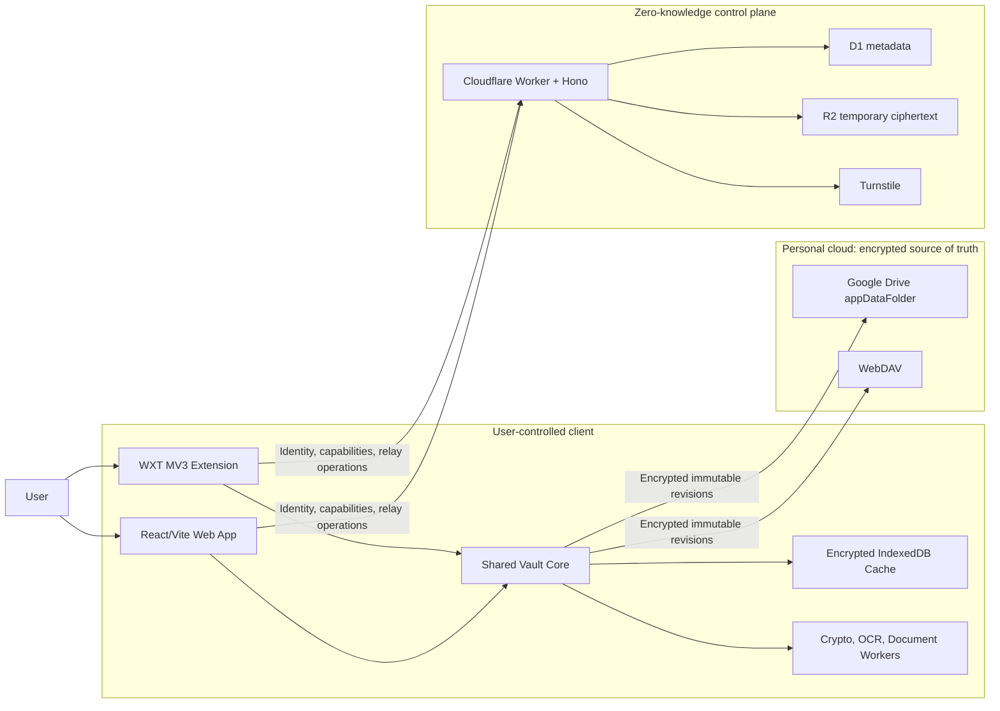
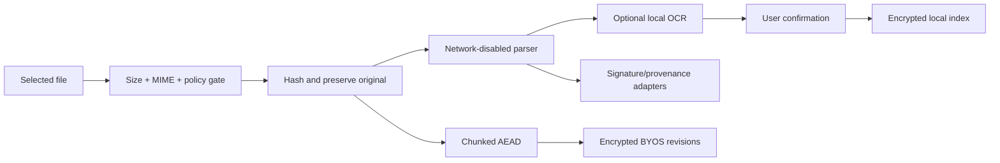
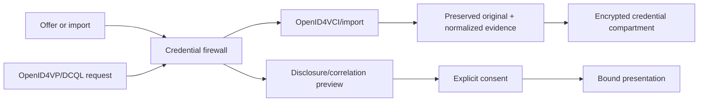

# System Architecture

## Context

## Component responsibilities

### Web app

- Account connection and vault onboarding.
- Full vault, document, credential, security-dashboard, sync, and settings interfaces.
- BYOS OAuth and provider setup.
- Local cryptographic and document operations through shared packages/workers.

### Browser extension

- Secure unlock session.
- Login/TOTP/card/identity autofill and save/update prompts.
- Best-effort software passkey bridge.
- Extension-first WebDAV access where web CORS blocks requests.
- Compact vault/search/security interfaces.

### Shared client core

- Crypto envelopes and key slots.
- Item/revision schemas and migrations.
- Encrypted local persistence.
- Sync and provider contracts.
- Password analysis and import/export.
- Document ingestion/intelligence.
- Credential adapters, trust, status, issuance, and presentation.

### BYOS providers

- Store opaque immutable revisions, encrypted chunks, tombstones, and rebuildable snapshots.
- Never receive plaintext or client keys.
- Provider-specific consistency, quota, and listing behavior is normalized by adapters.

### Control plane

- Verify application identity without participating in vault unlock.
- Store minimal account/capability/rate-limit data.
- Relay temporary Secure Send ciphertext.
- Apply abuse controls.
- Publish non-sensitive configuration and service status.

## Trust boundaries

1. **Unlocked client memory:** Plaintext exists only as required for active operations.
2. **Extension-world boundary:** MAIN-world page code is hostile; content-script and extension messages require strict schemas and origin checks.
3. **Worker/parser boundary:** Files, OCR output, credentials, metadata, and render instructions are untrusted.
4. **BYOS boundary:** Provider responses can be stale, duplicated, reordered, missing, malicious, or corrupt.
5. **Control-plane boundary:** The server is honest-but-curious for privacy design and potentially compromised for security design.
6. **Issuer/verifier boundary:** Credential ecosystem actors are not trusted merely because they use a standard protocol.

## Data flows

### Vault write

1. Validate the domain model in the client.
2. Create an immutable revision and hybrid logical timestamp.
3. Encrypt/authenticate with the item's data key.
4. Commit ciphertext to IndexedDB.
5. Upload ciphertext to BYOS when connectivity permits.
6. Record an encrypted audit event.

### Vault read

1. Retrieve encrypted local/provider state.
2. Verify envelope and revision authentication.
3. Decrypt only after vault and required compartment unlock.
4. Validate the decrypted schema before rendering.

### Document ingest

### Credential exchange

## Deployment units

- Static web assets.
- Chromium extension package.
- Firefox extension package.
- Cloudflare Worker.
- D1 schema/migrations.
- R2 bucket/lifecycle configuration.
- Shared versioned TypeScript packages built in one monorepo.

## Architectural limits

- A compromised unlocked endpoint can read active plaintext.
- Traffic analysis can reveal account activity, timing, provider use, and ciphertext sizes.
- Web clients cannot promise native secure-element attestation or ISO mdoc proximity behavior.
- Relay deletion cannot revoke recipient-downloaded plaintext.
- Free-tier infrastructure is not an SLA.
