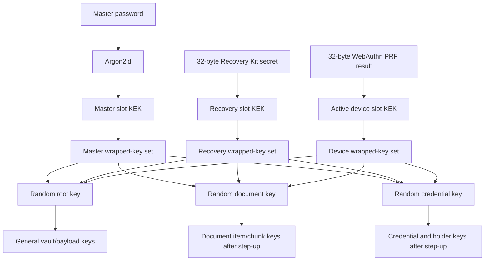

# Cryptography and Key Management

## Design goals

- A server or storage provider cannot derive vault keys.
- Master-password changes do not require bulk item re-encryption.
- Recovery and device unlock are independent wrappers, not alternate copies of the password.
- Sensitive compartments remain sealed after ordinary vault unlock.
- Records and chunks fail closed on tampering, truncation, reordering, or version confusion.
- Formats can migrate without silently interpreting old ciphertext under new rules.

## Approved primitives

Task 2 selected the browser primitive boundary in [ADR-021](21-architecture-decisions.md), and Task 3 extended its reviewed use in [ADR-022](21-architecture-decisions.md). Future algorithms and serialized versions still require implementation-time review. The current approved implementation is:

- **Password KDF:** `libsodium-wrappers-sumo@0.8.4` Argon2id 1.3 with a 19,456 KiB/t=2/p=1 floor, measured 350 ms target, and 65,536 KiB V1/V2 cap.
- **Key derivation/domain separation:** Native Web Crypto HKDF-SHA-256 with explicit context labels.
- **Authenticated encryption:** libsodium XChaCha20-Poly1305-IETF with 24-byte random nonces.
- **Recovery encoding:** Exact `@scure/base@2.2.0` Bech32m with a versioned `zkwr` payload and BIP-350 checksum.
- **Randomness:** Platform `crypto.getRandomValues` only.
- **Hashing:** SHA-256 or stronger standards-required hash; never invent a custom hash construction.
- **Credential signatures:** Standards-mandated algorithms through reviewed JOSE/COSE/WebCrypto-compatible implementations.

Primitive calls are isolated behind project-owned crypto and vault boundaries; application code does not implement cryptographic primitives from scratch.

## V2 key hierarchy

### Root vault key

A random 32-byte key is generated during vault creation. It protects the Task 3 payload and authenticates the mutable V2 bootstrap header through domain-separated derived keys; it never derives directly from the master password, Recovery Kit, or PRF output.

### Compartment keys

Document and credential compartments use independent random 32-byte keys. Ordinary unlock unwraps only the root key. A fresh password, Recovery Kit, or approved PRF step-up must first unwrap the same slot's root and compare it with the active root session before the requested key is accepted. This prevents a valid wrapper set from a different root context from opening a compartment in the current session.

Compartment sessions expire after a non-sliding 60-second default and never outlive the five-minute sliding root idle session. Explicit lock, conflict, expiry, and superseding lifecycle events clear their controllable buffers best effort.

### Item and chunk keys

Task 4 will introduce random per-item data-encryption keys wrapped by compartment keys. Large-object chunk keys and their ordering/context rules remain later roadmap work; Task 3 does not create item records or sync objects.

## V2 key slots

`VaultHeaderV2` contains one master-password slot, one Recovery Kit slot, and up to 16 WebAuthn PRF device records. Each active slot carries separate XChaCha20-Poly1305 envelopes for root, document, and credential keys. Wrapper AAD binds the purpose, vault ID, slot ID, envelope/algorithm version, and schema version.

A revoked device record is a wrapper-free tombstone containing only its slot identity, type/version, and `revoked` status. Revocation prevents future use after the updated header is observed; it cannot retroactively erase a key or PRF result already extracted on a compromised endpoint.

## Recovery Kit

- Generate exactly 32 random bytes; never derive recovery material from questions, account identity, or the password.
- Encode as Bech32m with `zkwr`, version word `1`, and a BIP-350 checksum; display uppercase grouped text and reject mixed case, wrong prefix/version/length/checksum, and non-canonical encodings.
- Persist only independently authenticated key wrappers. Never persist or log the Recovery Kit secret or a plaintext verifier.
- Require explicit re-entry to complete the drill. The encrypted payload records only whether the drill succeeded.
- Permit ordinary root unlock and document/credential step-up through the Recovery Kit path.
- Clean-profile restore accepts a strict encrypted V2 bootstrap, authenticates all recovery wrappers, the full security header, and the payload, then creates a new master-password slot.
- If every master/device method and the Recovery Kit are lost, recovery is intentionally impossible.

## WebAuthn PRF device unlock

- Use only the native WebAuthn Level 3 `prf` extension; never emulate it with a normal passkey signature.
- Offer enrollment only after positive `extension:prf` capability reporting, then require PRF-enabled credential evidence and a fresh assertion returning exactly 32 bytes.
- Use random challenges and a random per-slot 32-byte PRF input, request user verification, and avoid attestation.
- Use the PRF result only as HKDF input for the slot's three key wrappers, then wipe controllable input/output arrays best effort.
- Reject revoked slots before starting a ceremony and require explicit device selection where multiple active slots exist.
- Preserve password and Recovery Kit fallback. Real browser/authenticator compatibility remains unclaimed until the release matrix in [`18-risks-and-release-gates.md`](18-risks-and-release-gates.md) is executed.

## Root-authenticated V2 security header

Every V2 header has a canonical base64url `securityTag` encoding exactly 40 bytes:

1. Derive a 32-byte header-authentication key from the root key and vault ID using HKDF-SHA-256 label `zk-wallet/v2/header-authentication`.
2. Canonically JSON-serialize every mutable V2 security field except `securityTag`: device slots, encrypted payload, format, master slot, minimum client version, recovery slot, revision, vault ID, and version.
3. Generate a fresh 24-byte nonce and seal empty plaintext with XChaCha20-Poly1305 using those canonical bytes as AAD.
4. Store `nonce || 16-byte authentication tag` as the 40-byte canonical base64url field.

The tag binds revision, wrappers, device status, payload ciphertext, and format markers as one root-authenticated unit without rewriting payload ciphertext during password rotation. V2 unlock, Recovery Kit restore, and every privileged live-session read verify it. All generated create/replace headers are strictly parsed before persistence.

During a live root session, a persisted revision below the authenticated revision, an invalid tag, replayed component, or unauthenticated forward payload causes an immediate lock and `VAULT_WRITE_CONFLICT`. A valid newer revision is adopted only after header and payload authentication, and existing compartment sessions are cleared. A self-consistent historical header presented to a fresh client cannot be proven stale without an external trusted checkpoint; immutable sync ancestry remains later roadmap work.

## Envelope and error requirements

Every encrypted envelope authenticates:

- Format and algorithm version.
- Vault/compartment/item identity as applicable.
- Revision identity and ancestry where the format defines them.
- Content schema version.
- Purpose/domain label.
- Ciphertext and nonce.

Unknown versions fail closed. Decryption output is schema-validated before use. Wrong secrets and authenticated-data corruption collapse to non-sensitive method-specific failures, while operational `CRYPTO_UNAVAILABLE`, unsupported-version, and KDF-policy errors remain distinguishable so the UI can provide retryable guidance without mislabeling platform failure as bad credentials.

## Rotation, migration, and atomicity

- **Master-password change:** Authenticate the current master slot, rewrap the unchanged random root/document/credential keys, increment revision, and refresh the header tag. Payload, recovery, and device ciphertext remain unchanged.
- **Recovery replacement:** Authenticate through the active root session and password slot, generate new random recovery material/wrappers, reset encrypted drill state, increment revision, and refresh the header tag.
- **Device enrollment/revocation:** Add an active three-wrapper slot or replace it with a wrapper-free tombstone, increment revision, and refresh the tag.
- **V1 migration:** Only a successful authenticated V1 password unlock may atomically create V2 keys, Recovery Kit, encrypted drill state, revision, and tag. V1 is read-only.
- **Persistence:** Compare-and-replace is conditioned on vault ID, format version, and revision. A loser locks, clears session material best effort, reloads the winner's locked summary when safe, and never continues against stale state.
- **Later key/algorithm migration:** Write explicit versioned recoverable state and new immutable revisions; never silently reinterpret old ciphertext.

## Memory and deletion caveats

JavaScript runtimes do not guarantee deterministic memory zeroization. The implementation keeps secrets in byte arrays where practical, minimizes lifetime, overwrites controllable password, KDF, key, PRF, recovery, envelope, and authentication temporaries in `finally`, drops references, and clears secrets from UI state on submission and lifecycle/context changes. Runtime copies, strings, garbage collection, browser internals, authenticator state, caches, provider history, and backups remain outside deterministic control. Product claims must say “best effort,” never guaranteed erasure.
