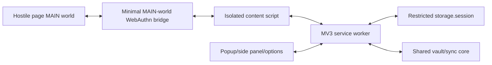

# Browser Extension Architecture

## Goals

- Deliver login/TOTP/card/identity autofill and capture.
- Provide secure access to the encrypted vault despite MV3 worker suspension.
- Support a best-effort software passkey flow without degrading native authenticators.
- Keep permissions and page exposure minimal.
- Share core logic with the web app while preserving browser-specific boundaries.

## Runtime components

### Service worker

Coordinates vault session, provider sync, item lookup, permissions, and extension messages. It must assume termination at any point. Durable operations use idempotent state transitions; no correctness depends on timers remaining alive.

### Extension UI

Popup/side panel/options pages run as trusted extension contexts. They show lock state, search results, fill choices, security warnings, and settings. Sensitive actions require an active session and sometimes step-up authentication.

### Content script

Runs in an isolated world, detects forms, and performs approved fills. It receives only the minimum fields needed for the active origin and operation. All messages are schema-validated and bound to sender tab/frame/origin.

### MAIN-world bridge

Used only where WebAuthn page API interception is required. It contains no vault keys or credential database. Requests and responses cross a narrow nonce-bound channel. The extension validates RP ID, origin, frame, challenge, algorithms, and policy before signing.

## Session handling

- Use browser `storage.session` only with trusted-context access restrictions and only for short-lived session material.
- Never write plaintext item collections, master passwords, or long-lived unwrapped compartment keys to persistent extension storage.
- Explicit lock clears session state and broadcasts to every extension context.
- Browser restart returns to locked state.
- Service-worker restart may restore the authorized session only within policy and without persisting plaintext to disk.

## Permission model

- No broad host permission at install unless strictly required by store/platform constraints.
- Request optional host access in response to a user action.
- WebDAV permission is restricted to the user-configured endpoint.
- Autofill access follows browser-supported site permission UX.
- Explain why each permission is needed and support revocation.

## Autofill security

- Canonicalize and display origin, scheme, registrable domain, and relevant IDN form.
- Match exact origins by default; related-domain use requires an explicit saved relationship/policy.
- Refuse automatic fill on HTTP, opaque origins, sandboxed frames, or cross-origin frames by default.
- Require user selection for ambiguous/multiple accounts and high-risk fields.
- Never expose unrelated vault matches to page scripts.
- Save/update prompts show the destination origin and changed fields.

## Software passkeys

- Private keys live in the credential compartment and synchronize as encrypted records.
- Support only validated WebAuthn algorithms and response structures.
- Respect RP ID rules, user presence/verification semantics, discoverable credentials, and counters.
- Do not silently suppress the native platform authenticator.
- Fall back cleanly when an operation, browser, or website is incompatible.
- Passkey import/export is not promised where source platforms provide no interoperable export.

## Cross-browser strategy

WXT supplies shared structure, but Chromium and Firefox builds have separate manifests, permissions, APIs, store policies, and E2E suites. Capability flags replace browser-name assumptions. Safari is deferred.

## Tests

- Worker suspension/restart at each operation boundary.
- Browser restart, lock timeout, and multiple extension contexts.
- Hostile/malformed messages and confused-deputy attempts.
- Fixture pages for SPA, shadow DOM, multistep, iframe, HTTP, IDN, and dynamic forms.
- WebAuthn registration/authentication, RP mismatch, replay, and native fallback.
- Permission request/revocation and WebDAV origin restrictions.
